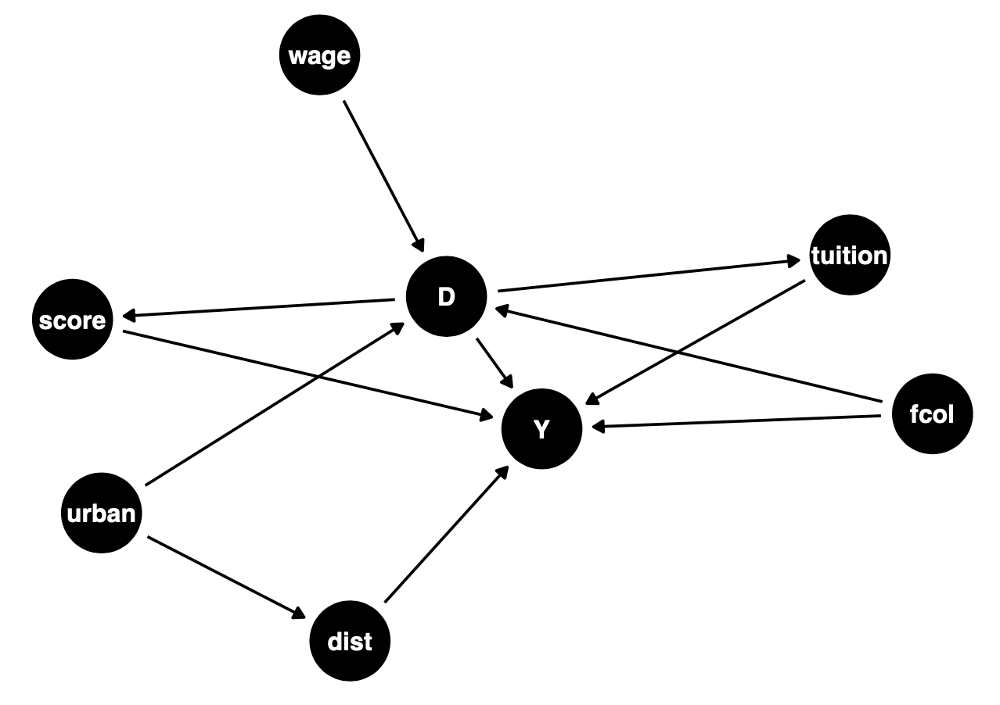

# Causal Effect of Income on College Enrollment

Project was to examine whether family income affects an individual's likelihood to enroll in college by analyzing a survey of approximately 4739 high school seniors that was conducted in 1980 with a follow-up survey taken in 1986.

- Estimated causal effect of family income on college enrollment in R through MatchIt with ATE of 0.91
- Implemented nearest neighbors matching after weakness of OLS regression F-Statistic of IV analysis
- Increased strength of ATE to compute 25x smaller standard error through bootstrapped regression

## Code and Resources Used

**R Version:** 4.2.2\
**Packages:** MatchIt, tidyverse, ggdag, dagitty, dplyr, knitr, estimatr, magrittr, haven, broom, readxl, AER\
**Source Code:** https://www.kaggle.com/datasets/iarunava/cell-images-for-detecting-malaria

## Data Collection

The data is based on a dataset from

> Rouse, Cecilia Elena. "Democratization or diversion? The effect of community colleges on educational attainment." Journal of Business & Economic Statistics 13, no. 2 (1995): 217-224.

The dataset is `college.csv` and it contains the following variables:

- `college` Indicator for whether an individual attended college. (Outcome)
- `income`  Is the family income above USD 25,000 per year (Treatment)
- `distance` distance from 4-year college (in 10s of miles).
- `score` These are achievement tests given to high school seniors in the sample in 1980.
- `fcollege` Is the father a college graduate?
- `tuition` Average state 4-year college tuition (in 1000 USD).
- `wage` State hourly wage in manufacturing in 1980.
- `urban` Does the family live in an urban area?

## Data Preparation

I created a DAG (Directed Acyclic Graph) to visualize the relationship between the treatment and outcome and other covariates. This also helped identify any confounders, mediators, and instrumental variables. Here's the DAG, and I identified the following:

  

- `wage`: instrumental variable
- `fcollege`: confounder
- `urban`: confounder
- `tuition`: mediator
- `score`: mediator

The helped identify the necessary steps to determine a causal effect between familial income and whether an individual attended college.

## Methodology 

I first checked all 3 general assumptions (SUTVA, ignorability, and positivity) and all deemed to hold true.

I then performed an instrumental variable test, however all 4 assumptions did not hold true. Specifically, I the First-Stage OLS Regression assumption did not hold true, as it failed the weak instrumental test. The resulting **F-statistic** was **24.17**, which was less than 100. Hence, I needed to find a different method, as `wage` did not constitute as a suitable instrumental variable.

This allowed me to proceed with the Matching Analysis, and further bootstrap for a more reliable statistic.

## Evaluation

I performed 3 Matching Analyses: nearest neighbors, exact, coarsened exact, and further bootstrapped. The results follow:

| Matching Analysis | ATE     | Standard Error | 95% Confidence Interval |
| ----------------- | ------- | -------------- | ----------------------- |
| Nearest Neighbors | 0.0954  | 0.0163         | (0.0634, 0.1274)        |
| Exact             | -0.1667 | 0.3073         | (-0.9567, 0.6233)       |
| Coarsened Exact   | 0.1002  | 0.0180         | (0.0648, 0.1355)        |
| Bootstrap (NN)    | 0.0919  | 0.0007         | (0.0906, 0.0932)        |

## Conclusions

I determined an Average Treatment Effect of **0.0919**, with a 95% confidence interval of **(0.0906, 0.0932)**. The most reliable method of the matching analyses was the nearest neighbors, which I further found a more reliable estimate using bootstrapping, as this resulted in a much smaller standard error. This was because nearest neighbors incorporated a much larger sample size, as coarsened exact matching failed to find many exact matches, despite still capturing an ATE. Moreover, the exact matching analysis failed to capture an ATE entirely, as the 95% confidence interval contained 0.

So, there exists an ATE among family income and its affect on an individual's likelihood to enroll in college.

## Considerations Going Forward

Going forward, the estimates can improve through more modern approaches to regression imputation and make use of different modeling strategies for capturing non-linearities such as cross-validation, generalized additive models, and kernel regression.

